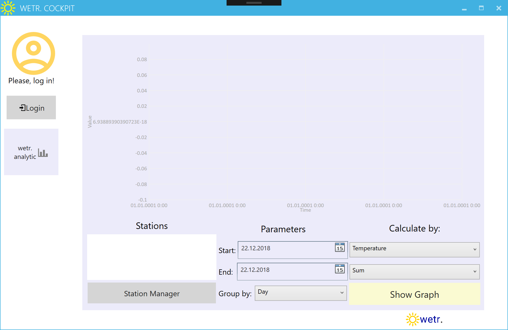
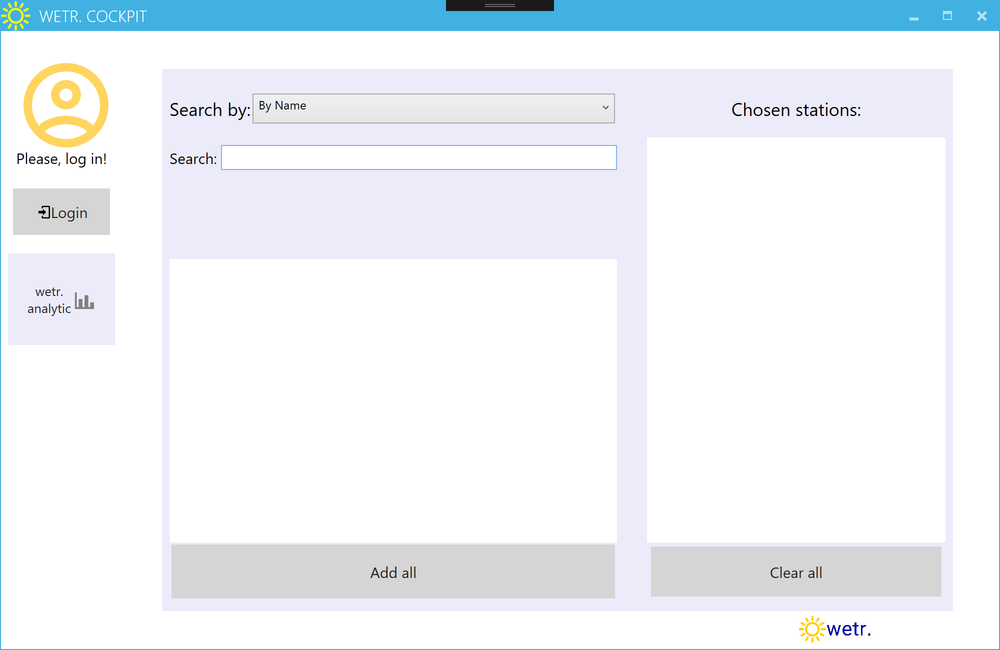
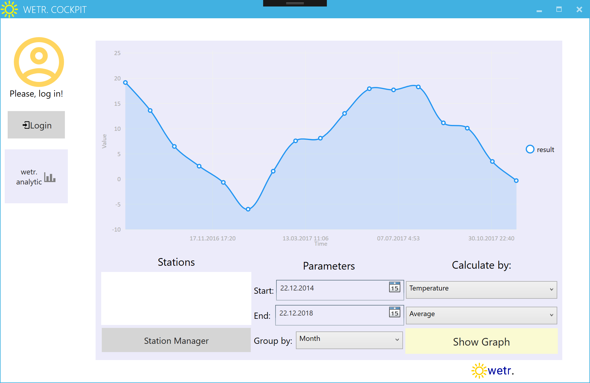
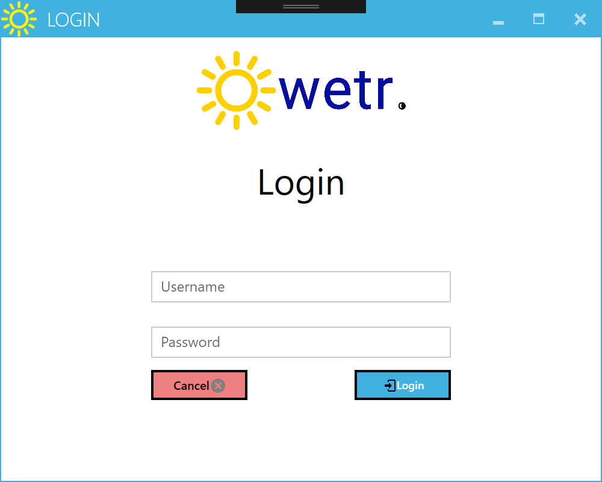
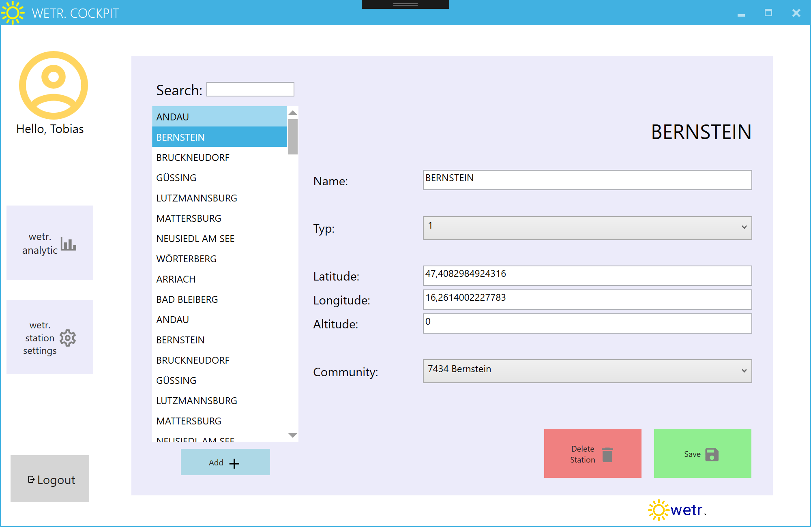
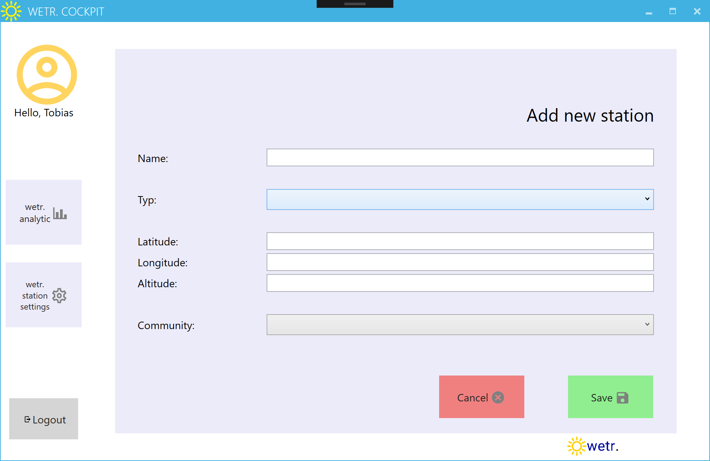
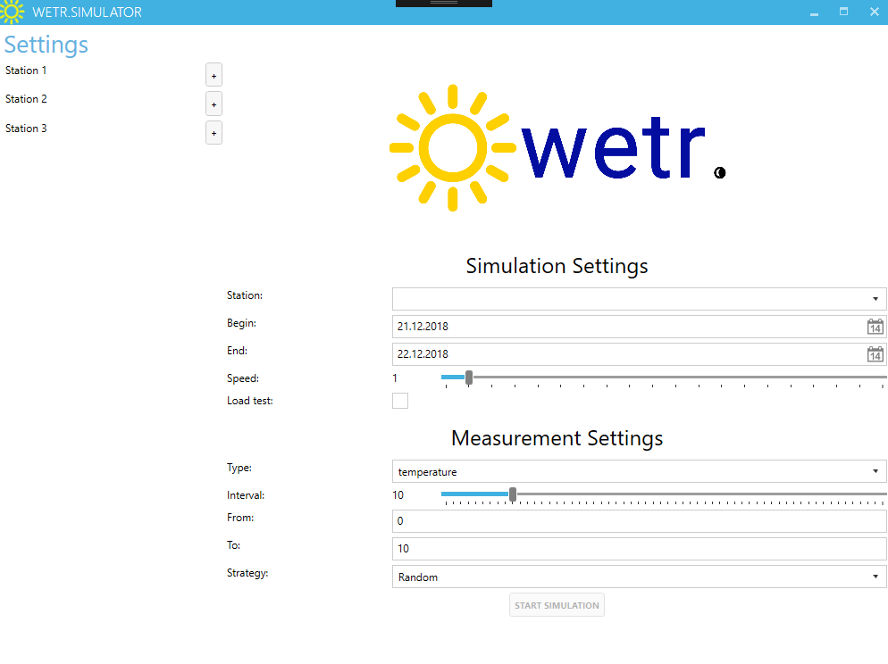
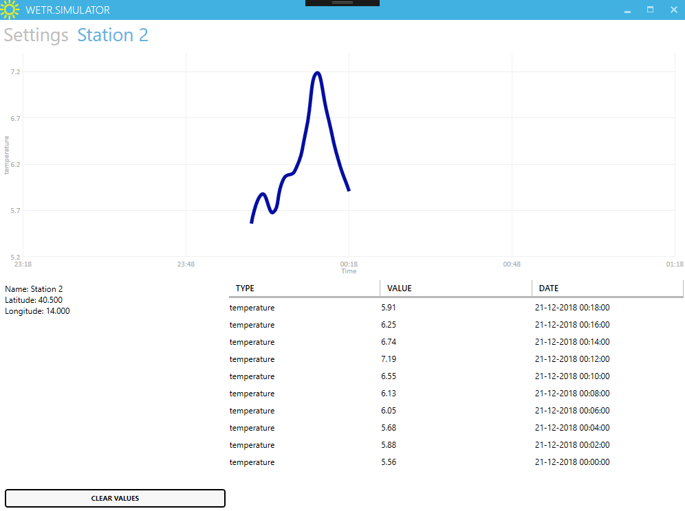

# Benutzerdokumentation Ausbaustufe 2

## Benutzerdokumentation Cockpit

Diese Benutzerdokumentation veranschaulicht die Funktionalitäten des Cockpits und die Benutzung dieser.

### Start

Wird das Cockpit gestartet öffnet sich gleich zu beginn das Analysefenster.

Hier können direkt Abfragen aus dem aktuellen Datensatz an Messdaten der Wetterstationen im System gemacht werden. Diese Messdaten können durch spezielle Filterkriterien analysiert und in einem Diagramm übersichtlich dargestellt werden.

Will man nun Analysen, die nicht alle Messdaten aller Stationen beinhalten, tätigen, kann der Stationsmanager verwendet werden, um nur ausgewählte Stationen zu analysieren.

Hier können Stationen nach folgenden Kriterien gefiltert werden:

* Name
* Region (stellt sich aus einem Punkt und einem Radius in KM zusammen)
* Gemeinde
* Bezirk
* Bundesland

Die Suchergebnisse der Filterabfrage werden in der linken Liste dargestellt, alle Stationen im Suchergebnis können über einen Button zur Analyse hinzugefügt werden. Die zur Analyse ausgewählten Stationen werden rechts angezeigt und können auch alle wieder über einen Button entfernt werden.

Wählt man nun z.B. eine Abfrage über die Durchschnittstemperaturen gruppiert nach Monaten aller Messwerte eines bestimmten Zeitraumes im System aus, bekommt man folgendes Ergebnis:

Möchte man nun die im System vorhandenen Wetterstationen bearbeiten, ist ein Login erforderlich. Nur registrierte Benutzer dürfen die von ihnen erstellten Wetterstationen bearbeiten.

Der Login wird über ein eigenes Fenster durchgeführt.

Nun können aus einer Liste die Stationen, die zu dem angemeldeten Benutzer gehören, bearbeitet werden. Diese Liste kann durch eine Suche nach dem Stationsnamen eingeschränkt werden.

Mit einem Button können von den Stationseinstellungen aus auch neue Stationen hinzugefügt werden.

## Benutzerdokumentation Simulator

### Simulationseinstellungen

Aus der Liste der Stationen in der linken Seitenleisten können Stationen der Simulation hinzugefügt werden. Diese sind dann in der Tableiste der Anwendung sichtbar. Über die Seitenleiste können sie auch wieder aus der Simulation entfernt werden.

Im Einstellungs-Panel können die Parameter der Simulation definiert werden. Es kann etwa eine Station ausgewählt werden, für die Messdaten generiert werden. Die generierten Daten werden im Tab der gewählten Station grafisch dargestellt.

Statt einer Station kann auch der Lastsimulationsmodus aktiviert werden. In diesem Modus werden für alle ausgewählten Stationen Daten generiert, jedoch werden diese nicht in der Anwendung dargestellt.

Es können auch weitere Parameter konfiguriert werden, wie etwa der Simulationszeitraum, oder die Geschwindigkeit, mit der Daten generiert werden sollen.

Für die Messdaten kann eingestellt werden, für welchen Messtyp, wie etwa Temperatur oder Niederschlag, sie erzeugt werden sollen. Es kann außerdem ein Minimal- und Maximalwert festgelegt werden. Weiters kann der Intervall gewählt werden, in dem neue Daten generiert werden sollen. Außderem kann die Verteilungstrategie gewählt werden, die festlegt, nach welchem Muster die Werte der Messdaten generiert werden.

Gewählt kann werden zwischen:

* Linear: Werte werden linear auf- bzw. absteigend generiert
* Random: Die Werte sind Zufallswerte zwischen dem Minimal- und Maximalwert
* Smart: Es werden Werte generiert, die je nach Tageszeit an- oder absteigen

### Simulationsergebnisse

Im Tab der gewählten Station können die generierten Daten angesehen werden. Diese werden sowohl in einem Graph als auch tabellarisch dargestellt. Über einen Button können die Tabelle und der Graph zurückgesetzt werden.

