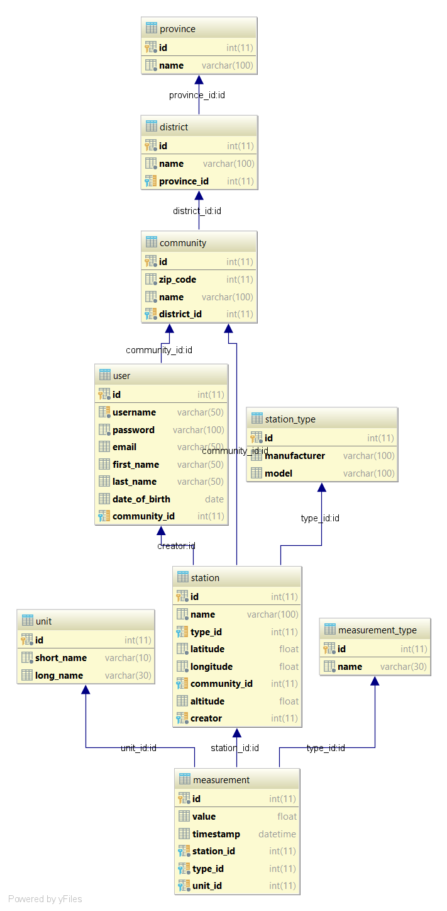

# Dokumentation Ausbaustufe 1

## Datenbankmodell

### Station

Für die Stationen werden ein Name sowie der Längen- und Breitengrad gespeichert. Außerdem wird gespeichert, welcher Stationstyp die Station ist und in welcher Gemeinde sie sich befindet. Für jede Station wird der User gespeichert, der die Station erstellt hat.

### Stationstyp

Es werden die Hersteller und die Modelle der Stationen gespeichert. 

### Bundesland, Bezirk, Gemeinde

Für alle Elemente werden der Name und eine ID gespeichert. Für die Bezirke wird gespeichert, in welchem Bundesland sie sich befinden. Für Gemeinden wird der Bezirk in dem sie sich befinden, sowie die Postleitzahl gespeichert.

### Benutzer

Für Benutzer der Anwendung werden eine ID, der Username, das Password, eine Email Adresse, der Vor- und Nachname und das Geburtsdatum gespeichert. Außerdem wird die Gemeinde, in der sie wohnen, gespeichert.

### Einheit

Für jede Einheit wird ein Kürzel (z.B. °C), sowie der volle Name (z.B. Grad Celsius) gespeichert.

### Messungstyp

Es wird der Name des Messungstyps (z.B. Temperatur, Luftdruck) gespeichert.

### Messung

Für jede Messung wird eine ID, der Wert der Messung und ein Timestamp mit Datum und Uhrzeit gespeichert. Außerdem werden der Typ sowie die Einheit der Messung und die Station, die die Messung durchgeführt hat, gespeichert.

 

## Datenbankzugriffsschicht 

Der Aufbau der ersten Ausbaustufe wurde nach dem DAO Muster realisiert. Es wurden Domänenklassen (Wetr.Server.Dal.Domain) mit Properties und Konstruktoren erstellt. Diese Domänenklassen können in Folge dann auch von der Geschäftslogik und bei der Implementierung der Interfaces für die Datenbankzugriffe verwendet werden. Die Implementierung der Interfaces wurde mit ADO.NET erstellt.

### Hilfsklassen(Dal.Common)

#### DefaultConnectionFactory

Um eine Datenbankverbindung herzustellen wird die Klasse DefaultConnectionFactory verwendet, mithilfe dieser Klasse kann eine Verbindung hergestellt werden, indem nur ein Konfigurationsname angegeben werden muss. Es wird dann nach einem XML-Element mit diesem Namen in der App.config Datei des jeweiligen Projekts gesucht, und der ConnectionString und der ProviderName aus dieser Datei für die Datenbankverbindung verwendet.

#### AdoTemplate

Die Klasse AdoTemplate stellt Methoden zur Verfügung, über die Abfragen auf die Datenbank ausgeführt werden können. Das ist mit den Query-Methoden möglich. Es können auch Anweisungen wie Insert, Update oder Delete über die ExecuteStatement Methoden durchgeführt werden. Es gibt für Query und ExecuteStatement jeweils synchrone und asynchrone Varianten. 

#### QueryParameter

Mit dieser Klasse können Parameter in SQL-Abfragen gesetzt werden. Die Klasse speichert die Werte, die diese Parameter in der SQL Abfrage ersetzten.

#### Delegates

In dieser Klasse werden notwendige Delegates für den Datenbankzugriff definiert, momentan ist ein Delegate für das Mappen von Queryergebnissen in ein Domainobjekt in der Klasse enthalten.

#### IConnectionFactory

IConnectionFactory dient als Interface für die Erstellung einer Datenbankverbindung. IConnectionFactory wird in diesem Projekt durch DefaultConnectionFactory implementiert.  

### Zugriffsklassen (Wetr.Server.Dal.Ado)

Funktionen für das Datenbankmodell wurden in Zugriffsklassen erstellt. Damit die Implementierungen der Funktionen leicht austauschbar bleiben, wurden die Zugriffsklassen in Interfaces definiert. Im Programm wird mit Domänenobjekten gearbeitet. Jede Tabelle im Datenmodell wurde in einer Domainklasse abgebildet.

Da der Datenbankzugriff etwas länger dauern kann, wurden alle Abfragen asynchron implementiert.

In der Folgenden Auflistung ist zu erkennen, welche Zugriffsfunktionen momentan für die jeweilige Datenbanktabelle im Interface definiert wurden. Diese wurden durch eine ADO.net Klasse ausimplementiert.

#### AdoProvinceDao

Abfrage nach:

* allen Bundesländern
* Bundesland mit bestimmter ID
* Bundesland mit bestimmtem Namen

Zusätzlich einfügen, aktualisieren und löschen von Bundesländern mit einem Bundeslandobjekt als Übergabeparameter.

#### AdoDistrictDao

Abfrage nach:

* allen Bezirken
* Bezirken mit bestimmter ID
* Bezirken mit bestimmtem Namen
* Bezirke eines bestimmten Bundeslandes

Zusätzlich einfügen, aktualisieren und löschen von Bezirken mit einem Bezirksobjekt als Übergabeparameter.

#### AdoCommunityDao

Abfrage nach:

* allen Gemeinden
* Gemeinden mit bestimmter ID
* Gemeinden mit bestimmtem Namen
* Gemeinden mit bestimmtem Bezirk
* Gemeinden mit bestimmter Postleitzahl

Zusätzlich einfügen, aktualisieren und löschen von Gemeinden mit einem Gemeindeobjekt als Übergabeparameter.

#### AdoStationDao

Abfrage nach:

* allen Stationen
* Stationen mit bestimmter ID
* Stationen mit bestimmtem Namen
* Stationen mit bestimmtem Stationstyp
* Stationen mit bestimmter Gemeinde
* Stationen mit bestimmtem Ersteller

Zusätzlich einfügen, aktualisieren und löschen von Stationen mit einem Stationsobjekt als Übergabeparameter.

#### AdoStationTypeDao

Abfrage nach:

* allen Stationstypen
* Stationstypen mit bestimmter ID
* Stationstypen mit bestimmtem Hersteller
* Stationstypen mit bestimmtem Hersteller und Bauart
  
Zusätzlich einfügen, aktualisieren und löschen von Stationstypen mit einem Stationstypobjekt als Übergabeparameter.

#### AdoMeasurementDao

Abfrage nach:

* allen Messungen
* Messungen mit bestimmter ID
* Messungen mit bestimmter Station
* Messungen in einem bestimmtem Zeitraum
* Messungen in einem bestimmtem Zeitraum und mit bestimmter Station
* Messungen mit bestimmtem Typ

Zusätzlich einfügen, aktualisieren und löschen von Messungen mit einem Messungsobjekt als Übergabeparameter.

#### AdoMeasurementTypeDao

Abfrage nach:

* allen Messungstypen
* Messungstypen mit bestimmter ID
* Messungstypen mit bestimmtem Namen

Zusätzlich einfügen, aktualisieren und löschen von Messungstypen mit einem Messungstypobjekt als Übergabeparameter.

#### AdoUnitDao

Abfrage nach:

* allen Einheiten
* Einheiten mit bestimmter ID
* Einheiten mit bestimmtem Kürzel
* Einheiten mit bestimmtem Einheitsnamen

Zusätzlich einfügen, aktualisieren und löschen von Einheiten mit einem Einheitstypobjekt als Übergabeparameter.

#### AdoUserDao

Abfrage nach:

* allen Benutzern
* Benutzern mit bestimmter ID
* Benutzern mit bestimmtem Benutzernamen
* Benutzern mit bestimmter Email
* Benutzern mit bestimmtem Benutzernamen und Passwort

Zusätzlich einfügen, aktualisieren und löschen von Benutzern mit einem Benutzerobjekt als Übergabeparameter.

Beim Einfügen eines neuen Benutzers wird das Passwort automatisch verschlüsselt.
Es gibt eine eigene Updatefunktion für das Updaten eines Passworts. Diese verschlüsselt das neue Passwort automatisch.
Zum Überprüfen ob ein verschlüsseltes Passwort zu einem unverschlüsselten Passwort passt, gibt es eine eigene Hilfsfunktion die ebenfalls in dieser Klasse definiert wurde.

## Tests (Wetr.Server.Dal.Test)

Für jede im Kaptitel Zugriffsklassen erstellte Funktion wurde ein Unit Test erstellt. Insgesamt wurden 69 Unit Tests erstellt. Jeder Unit Test hinterlässt die Datenbank so, wie vor der Ausführung war. Um das zu erreichen wurden z.B. beim Test von Einfügefunktionen Löschfunktionen mitverwendet. Bei Updatefunktionen wurde der aktualisierte Eintrag erneut auf den alten Wert aktualisiert. Für die Tests ist eine initialisierte Datenbank erforderlich. Als Testframework wurden die Standard Unit Tests wie sie in der Übung verwendet wurden angewendet.

## Testdaten

Die Datenbank wurde wie in der Angabe beschrieben mit Testdaten befüllt. Alle Mindestanforderungen wurden erfüllt oder überschritten. So sind z.B. alle Gemeinden, Bezirke und Bundesländer Österreichs in der Datenbank gespeichert. Außerdem werden 130 Stationen und rund 1,2 Millionen Messdaten verwendet.

## Installationsanleitung Ausbaustufe 1

Um die Testumgebung zu starten ist Docker notwendig. Da MySQL verwendet wird, wird auch der MySQL Connector für .NET benötigt.

Im Ordner db im Repository ist das PowerShell Script createDatabase.ps1 vorhanden. Da hier alle Testmessungen eingefügt werden ist die Installation zeitaufwändig. Um weniger Testmessungen einzufügen ist das createDatabaseMin.ps1 Script geeignet.

Ist der Dockercontainer erfolgreich gestartet und initialisiert können die Unittests in der C# Solution gestartet werden.