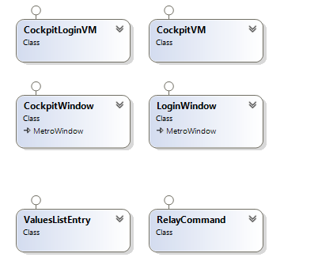
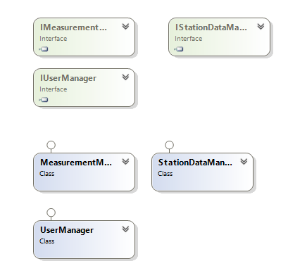
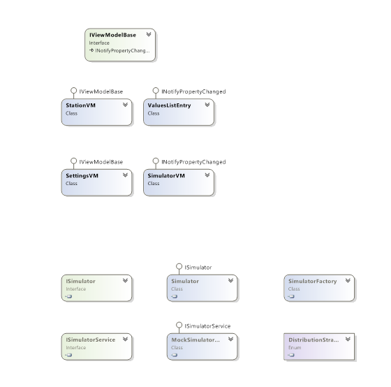
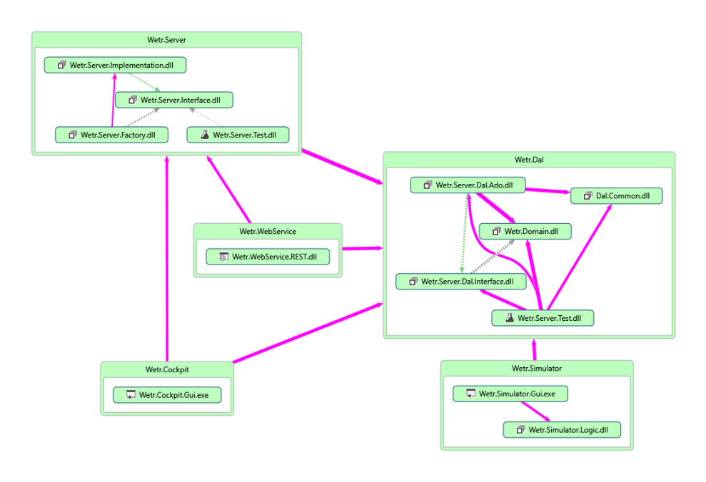

# Systemdokumentation Ausbaustufe 2

## Wetr.Cockpit

Das Cockpit dient zum Verwalten von Stationen und zum Erstellen von Analyseabfragen aus der Datenbank.
Für diese Analyseabfragen können verschiedene Filterkriterien hinzugefügt werden und das Ergebnis wird dann grafisch dargestellt.

Das Cockpit ist nach dem MVVM Prinzip erstellt worden.

### Cockpit Hauptfenster

Das Cockpit Hauptfenster enthält folgende Funktionen:

* Erstellen von Abfragen über den gesamten Messdatensatz
* Erstellen von Abfragen über den gesamten Messdatensatz einer Station/mehrerer Stationen mithilfe des Stationsmanagers
* Stationsdaten ändern
* Neue Stationen hinzufügen
* Anmelden von Benutzern

#### Aufbau XAML

Das XAML Dokument hinter dem Cockpit ist in mehrere Teilbereiche unterteilt. Eine Navigationsleiste an der linken Seite ermöglicht Zugang zum Login/Logout und zum Analyse und Stationen-Bearbeitungs Bereich.

Der größere rechte Teil ist der Bereich wo die Analyse oder die Stationsbearbeitung angezeigt wird.

Die einzelnen Funktionen sind in Unterfenster aufgeteilt. Diese werden mittels der Sichtbarkeit von ContentControl Elementen ausgetauscht.

Interaktionselemente mit der Logik wurden mittels Bindung verknüpft.

#### Aufbau Logik

##### Analysefunktion

Die eigentliche Datenanalyse passiert schon durch die Datenbank. Es können verschiedene Filterelemente in die Datenbankabfrage eingesetzt werden.

Da das Framework des Graphen nur ca. 1000 Datenpunkte ruckelefrei darstellen kann, wir eine Abfrage auf 1000 Ergebnisse beschränkt.

Verschiedene Error-Meldungen erleichtern den Umgang mit falsch angegebenen Parametern.

Die Stationen für die Abfragen können über einen Stationsmanager hinzugefügt werden. Hier kann durch verschiedene Filtermethoden nach den passenden Stationen gesucht werden und die Analyseabfrage dadurch weiter eingeschränkt werden.

##### Stationen bearbeiten

Stationen können nur angemeldete Benutzer bearbeiten. Dem Benutzer werden dann nur die Stationen aufgelistet, die er erstellt hat.

Zusätzlich können in dieser Funktion noch neue Stationen hinzugefügt werden.

### Cockpit Loginfenster

Das Loginfenster erscheint durch einen Button im Hauptfenster. Dabei wird das Hauptfenster geschlossen.

Der Benutzer muss sich nun mit Benutzername und Passwort authentifizieren. Ist der Login erfolgreich, wird der Benutzer zum Hauptfenster zurückgeleitet, hier ist nun in der Navigation der Menüpunkt Stationen bearbeiten sichtbar.

Ist der Login nicht erfolgreich wird der Benutzer mittels Error Messages darauf hingewiesen.

## Wetr.Server

Der Wetr.Server ist die Business-Logik des Wetr.Cockpit. Er stellt damit das Bindeglied zwischen Datenbank und GUI dar.

Die Benötigten Funktionaltäten im Wetr.Cockpit wurden in 3 Interfaces aufgeteilt:

* IMeasurementManager
* IStationDataManager
* IUserManager

Verwendet werden diese über die Statischen FactoryKlassen die zu jedem Interface implementiert wurden.

Die Implementierung enthält hauptsächlich den Aufruf der Datenbankabfragen. Zusätzlich werden Eingaben geprüft und Fehler behandelt.

### Tests

Für die Tests der Business-Logik des Servers wird das Mocking-Framework Moq verwendet. Dadurch können die Tests unabhängig von der Datenbank durchgeführt werden.

Getestet werden die Klassen zur Verwaltung von Benutzern, Stationen und Messdaten, die durch die Interfaces IUserManager, IStationDataManager und IMeasurementManager definiert werden.

Mit Moq kann festgelegt werden, welches Interface gemockt werden soll. Danach wird definiert, was bei welchen Methodenaufrufen passieren soll. Anschließend wird das Objekt für das Interface erzeugt, und die Testmethoden werden darauf ausgeführt.

## Wetr.Simulator

Im Simulator können Folgen von Messdaten für eine oder mehrere Stationen generiert werden.

### Aufbau der Logik

Über das Interface ISimulator wird der Funktionsumfang für den Simulator definiert. Die Klasse Simulator implementiert dieses Interface. 

Darin werden alle Einstellungen zur Simulation und zu den Messdaten verwaltet. Wenn der Simulator vom Benutzer gestartet wird, wird ein neuer Thread gestartet, indem die Simulationsmethode läuft. In dieser Methode werden die Werte generiert, de je nach gewählter Verteilungsstrategie von einer anderen Methode geliefert werden.

Der erzeugte Messwert wird dann mit dem Event MeasurementGenerated an die ViewModels weitergegeben. Über das Interface ISimulatorService kann der generierte Wert an den Server gesendet werden.

### Simulator-Fenster

Das Simulatorfenster ist in der Klasse SimulatorWindow und dem dazugehörigen XAML-File definiert.

Die Klasse SimulatorVM ist das ViewModel für die Anwendung, darin werden die Tabs und die ViewModels für deren Inhalte verwaltet.

Die Klasse SettingsVM enthält die Properties und Methoden für das Einstellungs-Panel in der Anwendung. Darin werden die Benutzeinstellungen für die Simulation und die Messwerte and den Simulator weitergegeben.

StationVM ist das ViewModel für die Stationen. Darin werden die Stammdaten der jeweiligen Station, sowie die Sammlung der generierten Messdaten für die Darstellung in der Anwendung verwaltet. Das ViewModel registriert sich auf das MeasurementGenerated-Event des Simulators. Durch dieses Event erhält das ViewModel die generierten Werte für die Darstellung.

#### Aufbau des XAML

Der Inhalt der Datei SimulatorWindow ist ein TabControl-Element, dass die Tabs der Einstellung und der gewählten Stationen enthält.
Mit einem TabDataTemplateSelector wird ausgewählt, ob die Template für die Einstellungen oder einer Station für die Anzeige verwendet werden soll.
Diese beiden Templates sind in den Ressourcen des Fensters definiert und werden dynamisch dem jeweiligen Element der Tab-Liste zugewiesen.

## Code-Map der gesamten Wetr-Anwendung:

